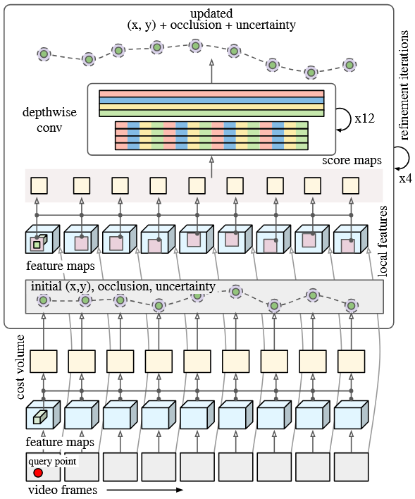

# Methodology and technical approach

In this section we will provide the theoretical knowledge and describe our progress throughout the two semesters.

## Previous papers

In the beginning, the team was given five papers which dealt approximately with tracking non-rigid objects:

1. Huang et al., Tracking Multiple Deformable Objects in Egocentric Videos ([Paper 1](https://openaccess.thecvf.com/content/CVPR2023/papers/Huang_Tracking_Multiple_Deformable_Objects_in_Egocentric_Videos_CVPR_2023_paper.pdf))
2. Zhang et al., Self-supervised Learning of Implicit Shape Representation with
   Dense Correspondence for Deformable Objects ([Paper 2](https://openaccess.thecvf.com/content/ICCV2023/papers/Zhang_Self-supervised_Learning_of_Implicit_Shape_Representation_with_Dense_Correspondence_for_ICCV_2023_paper.pdf))
3. Henrich et al., Registered and Segmented Deformable Object Reconstruction
   from a Single View Point Cloud ([Paper 3](https://openaccess.thecvf.com/content/WACV2024/papers/Henrich_Registered_and_Segmented_Deformable_Object_Reconstruction_From_a_Single_View_WACV_2024_paper.pdf))
4. Wang et al., Neural Textured Deformable Meshes for Robust Analysis-by-Synthesis ([Paper 4](https://openaccess.thecvf.com/content/WACV2024/papers/Wang_Neural_Textured_Deformable_Meshes_for_Robust_Analysis-by-Synthesis_WACV_2024_paper.pdf))
5. Xiao et al., SpatialTracker: Tracking Any 2D Pixels in 3D Space ([Paper 5](https://arxiv.org/pdf/2404.04319))

The task was to analyze whether one of the papers provides a useful approach for our task. Therefore, let us first consider the goals for this project:

1. Target objects of the tracking algorithm are resistance bands, gymnastic balls and smaller soft balls.
2. The work is motivated by the need to support physical therapy patients through the monitoring and assessment of correct exercise execution.
3. Most of the time one of the above mentioned objects is present in the frame. We focus more on the quality of tracking than on several objects.
4. Runtime of the approach is initially secondary.
5. The training data is mainly in 3D.

So let us have a short look on the first four papers.

Paper 1 by Huang et al. focuses on tracking multiple deformable objects in egocentric videos where the camera is mounted on a person. The method relies on template matching with learned features to track objects. This approach is problematic for tracking things like resistance bands because they undergo significant and often unpredictable deformations, including self-occlusions and changes in topology (e.g. twisting). This approach cannot handle such extreme changes as the movement of resistance bands and gymnastic ball is too complex.

Zhang et al.'s work (Paper 2) addresses self-supervised learning of implicit shape representations for deformable objects. The method is designed for learning a 3D representation from multiple views or a canonical pose. The primary goal is to establish dense correspondence for a single object, not to track its position and deformation in a dynamic video sequence. Furthermore, the objects considered in this paper, e.g. animals, are typically less flexible than a resistance band, making it unsuitable for the extreme deformations of a resistance band or a soft ball. The method would likely be too slow and would not generalize well to the continuous, unpredictable movements of sports equipment.

The paper 3 by Henrich et al. contributes to reconstructing and segmenting deformable objects from a single-view point cloud. This method is primarily concerned with 3D reconstruction, not tracking. It takes a static snapshot (a single point cloud) and tries to reconstruct the object's shape and segment it. This is a fundamentally different problem from tracking an object's movement and deformation over a sequence of video frames. While it deals with deformable objects, its single-view, static-frame nature makes it completely unsuitable for the continuous, dynamic process of tracking gym equipment in motion.

Wang et al. propose neural textured deformable meshes for robust analysis-by-synthesis. This paper focuses on reconstructing and tracking deformable objects with a pre-trained template mesh. The method requires a canonical, or rest, shape of the object. While it can track deformations, it's designed for objects whose topology remains relatively stable and predictable, such as a face or a piece of clothing. A resistance band's deformation is often so complex that it can change its topology, twisting and folding in ways that are difficult to model with a single pre-defined mesh template. A ball, while simpler, can also be challenging due to its smooth, textureless surface, which provides few features for the method to attach to. This approach would likely fail when the object undergoes extreme changes not captured by the initial mesh.

As a short conclusion, it can be said that the first four approaches are not useful for achieving the desired results mainly due to the extreme deformation of the objects. Therefore, all of the mentioned papers except the SpatialTracker are dismissed in our future work.

## Comparison of existing tracking methods

As the only option being left over is the SpatialTracker.This is the one we focus on in the next steps. In the paper of the SpatialTracker, the performance was compared with a few other tracking models. We decided to have a closer look on two of them because we considered them as relevant in the beginning. As for this, in the following paragraph, we focus on below listed models:

- Karaev et al., CoTracker: It is Better to Track Together ([Paper CoTracker](https://arxiv.org/pdf/2307.07635))
- Doersch et al., TAPIR: Tracking Any Point with per-frame Initialization and temporal Refinement ([Paper TAPIR](https://arxiv.org/pdf/2306.08637))
- Xiao et al., SpatialTracker: Tracking Any 2D Pixels in 3D Space ([Paper SpatialTracker](https://arxiv.org/pdf/2404.04319))

### TAPIR

TAPIR is a deep neural network model designed for the task of **Tracking Any Point** (TAP). Its main goal is to accurately follow a specific point of interest throughout a 2D video sequence, even if that point is on a deformable object, becomes occluded, or changes its appearance. It works in two steps: **per-frame initialization** and **iterative refinement**. The figure below shows the architecture of TAPIR.



The lower part of the figure shows the **per-frame initialization**. It focuses on finding potential matches for a given query point in each new frame of the video. This step is designed to be robust to the challenges of deformable object tracking. The key idea is to use a matching network (CNN) that compares the query point's features with the features of every other pixel in the target frame. This step outputs three initial values:

- initial guess for the trajectory (x, y)
- probability for occlusion
- uncertainty probability

In the second stage, the **iterative refinement**, which can be seen on the upper part of the figure, the above mentioned initial guesses are improved. For each potential position found during the initialization phase, the model defines a local neighborhood window around it. This window acts as a search area for refining the point's exact location. The refinement itself is achieved by comparing the visual features within this neighborhood to the features of the original query point. This comparison generates score maps indicate the similarity between the query point's features and every pixel within the neighborhood window. The highest-scoring pixel in this map represents the most probable refined position for the tracked point in that specific frame. This process is executed iteratively, allowing the model to correct small errors and ensure that the final trajectory is smooth and consistent over time.

#### Pros and Cons
Tapir tracks points well. It provides smooth motion tracking that detects even the smallest changes. Only in cases of significant occlusion or excessively fast movements is the point lost. Tapir can also be run in real time. However, a major disadvantage is that only 2D trajectories are estimated and the lifting to 3D is not considered.

### CoTracker

CoTracker is a paper that introduces another approach to point tracking in 2D videos. The core idea is that instead of tracking each point independently, it is more effective to track many points jointly, taking into account their dependencies and correlations. In the figure below the architecture is shown.


Unlike TAPIR that treats each point's trajectory as an independent problem, CoTracker uses a Transformer-based network to model the relationships and dependencies between multiple points simultaneously. The heart of this system is a powerful attention mechanism that enables the network to exchange information between different tracks and across various time steps within a given window of frames. This ability to collectively reason about the motion of multiple points makes CoTracker exceptionally robust. Furthermore, CoTracker is an online algorithm, meaning it can process video frames in real-time. To handle very long videos, it uses a sliding window approach. To achieve this, the model is trained in an unrolled fashion, like a recurrent neural network. The predictions from one window are used to initialize the tracks for the next overlapping window. This allows the model to maintain track consistency and accuracy over long durations.

The output of CoTracker is:

- Trajectory (x, y) over all frames
- occlusion probability

#### Pros and Cons
By jointly tracking many points with a Transformer, CoTracker exploits inter-point correlations, which improves robustness to occlusions and even when points leave the field of view; it also scales to tens of thousands of points on a single GPU. Its main drawbacks are sensitivity to domain gaps—trained largely on synthetic data, it can mis-handle reflections/shadows—and, by design, joint attention over many points entails higher compute/memory than independent per-point trackers.

### SpatialTracker

SpatialTracker is a method that uses the CoTracker approach and extends its 2D point tracking to the 3D domain. As input data it uses either 2D videos (RGB) or videos with depth information (RGBD). The architecture can be found below.


SpatialTracker begins by estimating a depth map for each video frame and extracting dense image features, which are used to lift 2D pixels into 3D space to form a point cloud, see (a). As the monocular depth estimator (MDE) [ZoeDepth](https://arxiv.org/pdf/2302.12288) is used. These 3D points are then projected onto three orthogonal planes to create a compact triplane feature representation that enables efficient feature retrieval (b). An iterative transformer network refines the 3D trajectories of query points across short temporal windows, using extracted features from the triplanes as input (c). As a last step, the model learns a rigidity embedding that groups pixels with similar rigid motion. An As-Rigid-As-Possible (ARAP) constraint is then applied. The ARAP constraint enforces that 3D distances between points with similar rigidity embeddings remain constant over time.

while a rigidity embedding combined with an As-Rigid-As-Possible (ARAP) constraint enforces locally consistent motion.

The output of SpatialTracker is:

- 3D trajectory (x, y, z)
- occlusion probability

#### Pros and Cons
By lifting pixels to 3D (monocular depth → triplanes) and enforcing a rigidity embedding with an ARAP prior, it is robust to occlusions and out-of-plane motion and achieves strong results on long-range tracking benchmarks. Its accuracy depends on the quality/consistency of the depth input, and the pipeline incurs additional compute/memory from depth inference, triplane feature construction, and transformer updates compared to purely 2D trackers.

## Adaption and implementation

As a result of the SpatialTracker providing the best tracking performance (as it can be seen in the videos in the GitHub) and also provides 3D data as output, we only focus on the SpatialTracker in follow-up work. The other models can considered in future research. This section gives an overview of the adaption we made to the already provided code base: [Github SpatialTracker](https://github.com/henry123-boy/SpaTracker).

### Sliding window approach (online version)

To make SpatialTracker operate reliably on long and/or high-resolution sequences, we extended the original `demo.py` into a chunked online variant (`chunked_demo.py`). Instead of processing the entire clip at once, the video is split into temporal chunks of length `--chunk_size`. For each chunk we prepend a small overlap equal to half of the model’s sequence length (`--s_length_model / 2`). The model is run on *overlap + chunk*, but only the predictions belonging to the non-overlap part are retained. This keeps peak memory usage approximately constant while preserving sufficient temporal context at chunk boundaries.


**Initialisation**

In the first processed segment, query points are initialised on a regular grid restricted to an optional segmentation mask (`--grid_size`, `--mask_name`). For subsequent segments we do not re-sample; instead, the last predicted positions from the previous segment are used as the queries at the new segment start. In practice this yields stable identities and avoids repeated mask processing. If no valid points are available (e.g., prolonged occlusion), the pipeline proceeds with empty/dense queries until tracks re-emerge.

**Depth handling**

The script supports both monocular and RGB-D inputs. By default, monocular depth is computed on demand for the frames inside each model call. When `--rgbd` is set, per-frame depth maps (pre-aligned to the RGB preprocessing) are injected directly, bypassing the MDE. This path is used for our ToF-based comparisons.

**Preprocessing and outputs.** We optionally sub-sample frames (`--fps`) and apply crop/downsample operations (`--crop`, `--crop_factor`, `--downsample`) before inference; all trajectories are mapped back to the overlay/original resolution when saving. Each run exports an MP4 with overlays and a NumPy bundle with trajectories, visibility flags, frame indices, spatial metadata, and the full CLI configuration to ensure reproducibility.

**Key arguments**

* `--chunk_size`: frames per output segment.
* `--s_length_model`: model window; overlap is half of this value.
* `--grid_size`, `--mask_name`, `--query_frame`: first-segment initialisation.
* `--rgbd`: use external depth instead of monocular depth.
* `--fps`, `--downsample`, `--crop`, `--crop_factor`: temporal/spatial preprocessing.
* Visualisation controls: `--point_size`, `--len_track`, `--fps_vis`, `--backward`, `--vis_support`.

**Example**

```bash
python chunked_demo.py \
  --root ./assets \
  --vid_name Gymnastik_1_5s \
  --mask_name Gymnastik_1_5s_mask.png \
  --grid_size 50 \
  --chunk_size 30 \
  --s_length_model 12 \
  --fps 1.0 \
  --downsample 0.8 \
  --rgbd
```

### Video Depth Anything

This section deals with depth estimation models of the SpatialTracker. To choose between different MDEs one can specify the argument `--depth_model`. The argument gets then forwarded to the `mde.py` file. All functionality for loading the MDE model and generating depth maps is implemented in this file. This script supports various state-of-the-art monocular depth estimation models such as MiDaS, ZoeDepth, Metric3D, Marigold, and Depth-Anything. Depending on the user-defined argument, the corresponding model is loaded in evaluation mode and used to infer depth maps from single RGB images. The inference process produces either relative or metric depth, and in some cases, such as with Depth-Anything, additional alignment steps are performed to calibrate the predicted relative depth to metric scale using a reference model. The script also converts the estimated depth maps into 3D point clouds using the camera intrinsics. The resulting 3D reconstructions are exported as colored point clouds in .ply format, which enables further processing.

By default the ZoeDepth estimator is used. The architecture is shown below.


ZeoDepth consists of two stages. First, the model is extensively pre-trained on a vast amount of data to understand relative depth, learning which objects in a scene are closer or farther from each other without worrying about specific units of measurement. Second, the model is then fine-tuned on smaller datasets that contain ground truth metric depth (exact distances in meters). Instead of simply learning a single, precise value, ZoeDepth uses a unique **metric bins module** that estimates a range of possible depth values for each pixel. In the end, ZoeDepth outputs metric depth maps.

For our work we extended the SpatialTracker by another depth estimator. We were recommended Video Depth Anything: Consistent Depth Estimation for Super-Long Videos ([Paper VideoDepthAnything](https://arxiv.org/pdf/2501.12375)) by Chen et al. The depth estimator can be chosen by setting the argument `--depth_model` to either `zoe` or `depth_anything` in the file `chunked_demo.py`.

Video Depth Anything is build upon the strengths of Depth Anything to handle long-duration video sequences with high quality and temporal consistency. The authors introduce a lightweight **spatiotemporal head** on top of the Depth Anything V2 encoder that allows the network to share information across consecutive frames. Instead of relying on optical flow or camera pose (absolute depth values), they introduce a simple temporal consistency loss that encourages smooth changes in depth across frames. For long videos, the method processes clips segment by segment. The figure below illustrates the processing pipeline.


### Mask Selection with Segment Anything and CLIP

To determine the initial positions of the tracking points, we generate masks that detect and highlight the sports equipment. For implementation, Meta AI's SegmentAnything Model (SAM) [[Github SAM](https://github.com/facebookresearch/segment-anything)] is used to generate segments, and then Clip ([Paper CLIP](https://arxiv.org/pdf/2103.00020)) is used to select the most suitable segment for mask creation.


**Context**


The Segment Anything Model is a model for creating segments. SAM takes an image as input, optionally with prompts such as points, boxes, or masks. The image is processed by an image encoder to extract feature embeddings, which are then combined with the prompt embeddings. A mask decoder then predicts the pixel-precise masks from the combined embeddings. The whole thing was pre-trained on a dataset with over 11 million images, so that the model can now also create a mask for unknown objects (zero-shot generalization). The masks are output as well as a score that indicates the confidence. Text prompts are planned for use as prompts, but are not yet available. We therefore decided not to use prompts, so that segments are placed over the entire frame.


We then use CLIP (Contrastive Language-Image Pretraining) to select the most semantically appropriate mask. To do this, we selected reference images of sports equipment and used CLIP to obtain an embedding vectors for each reference image, representing their visual features. The cosine-based similarity is calculated for each segment and reference image embedding.  The mask with the highest similarity value is then selected as the result:

```py
clip_model, preprocess = clip.load("ViT-B/32", device=device)
for i, mask_data in enumerate(masks):
            seg_mask = mask_data["segmentation"]
            seg_embed = encode_image_clip(clip_model, preprocess, seg_mask, device)
            score = max(torch.nn.functional.cosine_similarity(seg_embed, ref_embed).item()
                     for ref_embed, _ in ref_embeds)
```


**Usage**

Parameters to be selected as input:

  `--video-path`: The path to the video.
  `--reference-images`: Folders containing reference images of objects to be detected.
  `--use-center-priority`: If set, the segment is selected based on its position (otherwise based on its shape). Priority is given to the most central location.

The program is started and a mask for the segment with the best score is selected and displayed. You can then interactively decide to select the mask with the next worst score, and so on. This allows you to select the appropriate mask even in cases of ambiguity.


**Difficulties/Evaluation**

We chose a gym ball, a sponge, and a softball as reference images. These objects are detected correctly. There are difficulties in detecting the resistance band, as its shape in the first frame is ambiguous and not very distinctive. As a result, other objects such as the door handle and those with small rectangular shapes are often detected incorrectly. We therefore implemented an approach that selects the segment with the smallest distance from the center.


## Data generation

To be able to evaluate our implementation in the next section, we need a data set. Therefore, we recorded approximately 50 videos with different features:

- Objects

  - Resistance band
  - Gymnastic ball
  - Soft ball
  - Sponge

- Video resolution

  - 1080p
  - 720p
  - 360p

- Video length
  - between 5 seconds and 30 seconds

### Ground truth

To obtain reliable ground truth depth information for evaluating the tracking performance, depth images were recorded using a Time-of-Flight (ToF) camera. In our case the Femto Bolt from Orbbec was used, see below.


As the ToF camera outputs only individual frames, both the color stream and the depth stream had to be synchronized and merged to obtain a temporally continuous RGB-D video. This preprocessing is done by a python script (`preprocessing.py`).
The camera uses an IR-sensor to generate the depth images which can be read out as a .raw file which is then converted in a NumPy array format (.npy) to ensure efficient loading and processing. Additionally, the frames of the video stream are concatenated to obtain a .mp4 video.

During experimentation, the `--rgbd` argument can be set when running the `demo_chunked.py`. It then feeds this pre-recorded depth information directly into the SpatialTracker, bypassing the monocular depth estimation module. This setup enables a direct comparison between the model’s predicted depth and the actual measured depth from the ToF camera, thereby providing a robust basis for assessing the accuracy and reliability of the tracker’s performance on deformable objects.
