# 3. Evaluation

ToDo

In this chapter we describe our evaluation process.
All the metrics used in the three papers of TAPIR, CoTracker, and SpatialTracker did not fit well for our purpose.
In the end, we agreed on two metrics, which are described first.
Afterwards, the results of each metric are discussed.
In addition, the runtime is evaluated.

## 3.1. Runtime evaluation

To assess runtime performance, we measured system resource usage for different parameters (video length, resolution, grid size, and data type).
Both RGB and RGB-D videos were tested to capture the computational overhead introduced by depth data.

| Factor              | Values tested               | Metrics collected                                                              |
| ------------------- | --------------------------- | ------------------------------------------------------------------------------ |
| **Video durations** | 5 s, 10 s, 30 s             | CPU usage (%), RAM (GB, %), Disk I/O (MB), GPU utilization (%) and memory (GB) |
| **Resolutions**     | 360p, 720p                  |                                                                                |
| **Grid sizes**      | 20, 50, 100 tracking points |                                                                                |
| **Data type**       | RGB vs. RGB-D               |                                                                                |

Metrics were recorded continuously during tracking.
The results are visualized as plots showing temporal resource usage and comparisons across grid sizes, resolutions, and data types.

### 3.1.1 Results of the Runtime evaluation

| Aspect                       | Findings                                                                           | Reference           |
| ---------------------------- | ---------------------------------------------------------------------------------- | ------------------- |
| **Execution Time**           | Runtime increases with video length and resolution. 720p \~5–10% slower than 360p. | see Figure 11       |
| **GPU Utilization & Memory** | GPU is main bottleneck (70–100%). Memory: ~ 22.8 GB (360p) vs. ~ 23.3 GB (720p).   | see Figure 12       |
| **CPU Usage**                | Low to moderate (7–9% avg, up to 65%). Not a bottleneck.                           | see Figure 13       |
| **System Memory (RAM)**      | 360p: 8–22 GB. 720p: up to 45 GB. Resolution roughly doubles RAM needs.            | see Figure 13       |
| **Disk I/O**                 | Low. Increases with video length (35–200 MB). Not a bottleneck.                    | see Appendix I      |

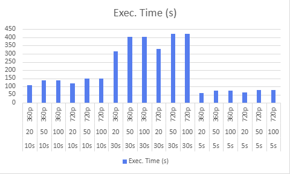

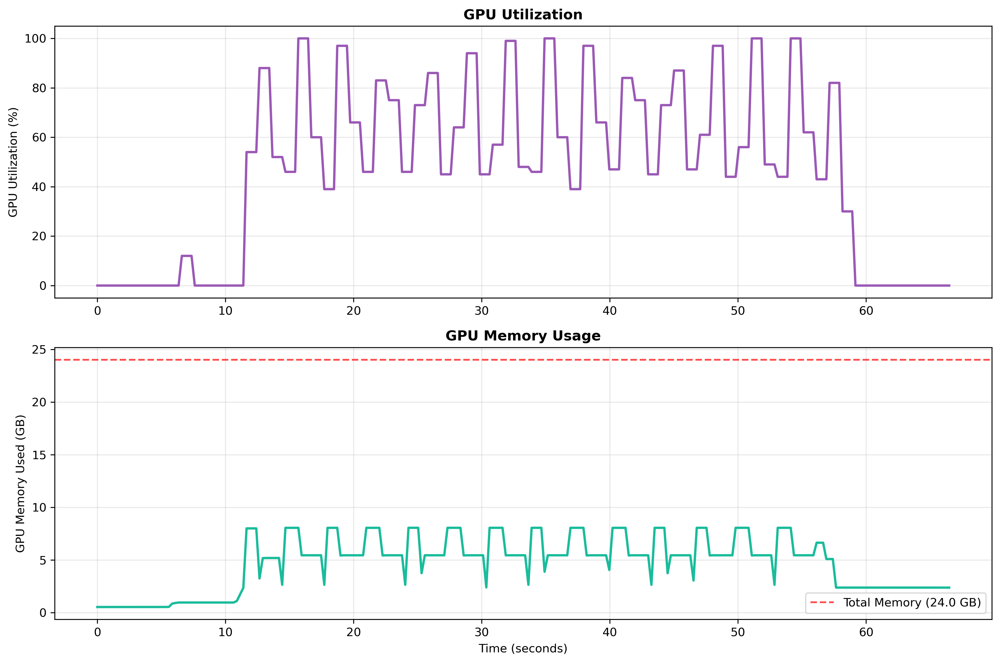

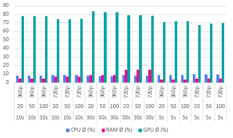

#### RGB vs. RGB-D
Processing with RGB-D consistently required more resources than RGB-only runs.
Execution times were 10–20% longer (see Figure 14), GPU utilization increased by 1–3%, and memory usage rose by 200–500 MB (see Figure 15).
Disk writes were also slightly higher (20–40 MB more per run).
These differences reflect the overhead of handling the depth channel, while CPU usage remained almost identical in both modes.
Overall, RGB-D provided richer tracking information, but at a stable and predictable computational cost across all test conditions.

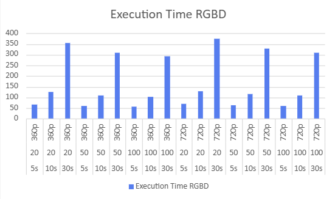

#### Parameter Scaling
Video resolution, tracking grid size, and video length all showed proportional effects.
Higher resolutions and larger grids led to longer runtimes and increased GPU memory demand.
Longer videos extended processing time in a nearly linear fashion.
Importantly, the relative overhead of RGB-D compared to RGB remained consistent under all scaling conditions.

### 3.1.2 Key Findings
- Execution time grows with resolution and length; 720p is consistently ~5–10% slower than 360p.
- GPU resources are the main bottleneck, with utilization frequently reaching 100%.
- RAM demand scales strongly with resolution, and 720p videos may exceed typical workstation memory.
- CPU usage remains moderate and stable, while disk I/O is negligible.
- RGB-D adds predictable overhead (10–20% more runtime, ~200–500 MB extra memory, slightly higher GPU and disk usage).

## 2D tracking efficiency
With this approach the tracking efficiency in the 2D space is evaluated. For this a short introduction into ArUco markers, as shown in the figure below, is needed. ArUco markers are binary square markers widely used in computer vision for camera pose estimation and object localization. Each marker consists of a unique black-and-white pattern which ensures robust detection under varying lighting conditions. By identifying the specific ID encoded in the marker’s pattern, computer vision algorithms can distinguish between different markers in a scene. In our tracking application, the detection of the position of the ArUco markers establish a ground truth trajectory which can then be used to compare against the real trajectory from the SpatialTracker.

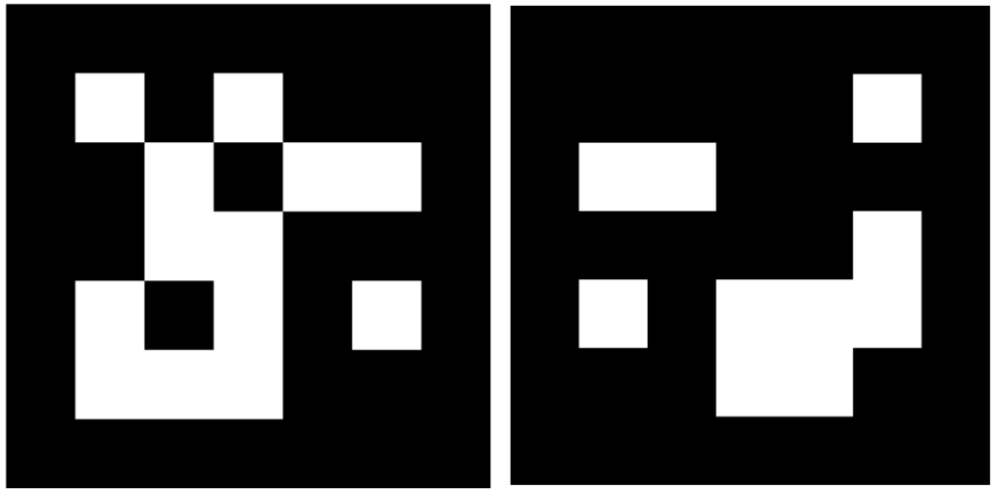

The figure below presents a schematic overview of the approach for one single frame. This setup is for demonstration purposes only and does not represent an actual experiment.

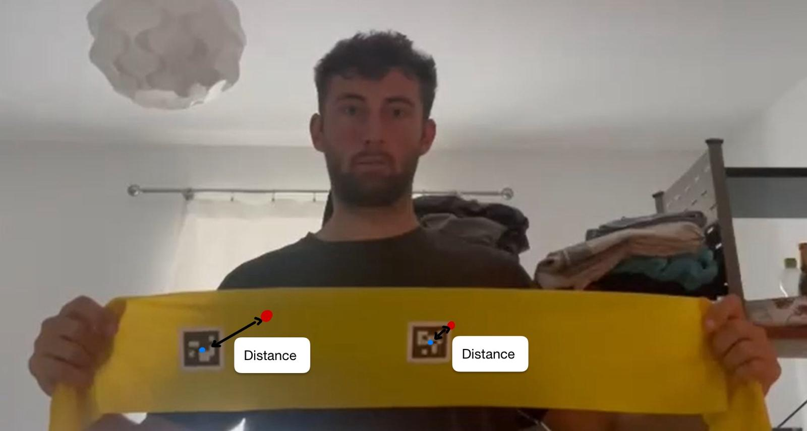

The experimental setup involved recording three video sequences, each the two ArUco markers shown above in a size of 4cm x 4cm attached to a resistance band which is recorded approximately from a distance of 1,5 meters. The setup includes three levels of difficulty in handling the resistance band:

1. Movement only – the band is simply moved without deformation.
2. With stretching – the band is actively stretched, introducing shape changes.
3. With occlusion – the ArUco markers are fully occluded during motion.  The arm is stretching so that the other side of the Theraband is visible and the markings are completely covered for 1 second.

Each video was first processed using a Python script (`arucoDetection.py`) which detects the ArUco markers in every frame. For each detected marker, the pixel coordinates of its midpoint were calculated and stored as a NumPy array file (.npy) for subsequent analysis. In above figure these are the blue points.

In the next stage, the same video was fed into the SpatialTracker. The points selected for tracking were the midpoints of the ArUco markers in the first frame of the video. SpatialTracker then computes the corresponding 3D trajectories of the points over time which were exported in JSON format for further evaluation. In the schematic these are represented by the red circles.

In the python script `evaluateTracking.py`, both stored files are loaded. The Euclidean distance between the pixel coordinates obtained from the SpatialTracker and those from the ArUco marker detection is then computed for each frame. The tracking evaluation produces several quantitative metrics, namely the maximum error, the root mean square error (RMSE), and the standard deviation of the errors. A larger distance indicates poorer tracking performance, whereas a smaller distance corresponds to better accuracy.

## Comparison between ToF ground truth and tracker

We implemented an end-to-end pipeline (`eval_pipeline.py`) to compare SpatialTracker outputs against ToF depth frames. Given a clip slug, the pipeline downloads and re-encodes the RGB video, derives a first-frame object mask (from the project’s segmentation), runs the chunked online variant of SpatialTracker, fetches the corresponding ToF `.npy` frames, performs a depth-aware analysis, and generates a ToF overlay video with track visualization.

### Coordinate mapping (processed → ToF)

Let $(x\_p,y\_p)$ be tracker coordinates at the processed resolution $(W\_{\text{proc}},H\_{\text{proc}})$, and $(W\_{\text{tof}},H\_{\text{tof}})$ the ToF frame size. We map to ToF pixel indices by

$$
s_x=\frac{W_{\text{tof}}}{W_{\text{proc}}},\quad s_y=\frac{H_{\text{tof}}}{H_{\text{proc}}},\qquad
(x_{\text{tof}},y_{\text{tof}})=\big(\,\mathrm{round}(s_x\,x_p),\;\mathrm{round}(s_y\,y_p)\big).
$$

#### Mask warp (geometric prior)

The first-frame binary mask is used only as a **geometric prior**. A homography $H$ is estimated from points that started inside the mask and are visible at $t=0$ and $t$:

$$
\begin{bmatrix}u\\v\\1\end{bmatrix}\sim
H\begin{bmatrix}x\\y\\1\end{bmatrix},\qquad
H=\text{RANSAC}\big(\{(x_0,y_0)\leftrightarrow(x_t,y_t)\}\big).
$$

The mask is warped to frame $t$ and slightly dilated to tolerate small warp errors. Membership in the warped mask counts as a positive vote.

#### Local ToF depth and object depth band

For a projected point $(x\_{\text{tof}},y\_{\text{tof}})$ we take a **robust local depth** as the median in a small window, ignoring zeros (no return).

To decide whether a tracked point is consistent with the ToF signal, we maintain an **object depth band** per frame. The band is estimated from ToF samples and smoothed over time using an exponential moving average. In the overlay path, depths are sampled inside the warped mask; in the metrics path, samples are taken at the current visible track locations (mask-agnostic). The band half-width uses the larger of a fixed minimum tolerance (≈6 cm) and a term proportional to the median absolute deviation (≈2.5×MAD). A point is accepted by depth if its local ToF median lies inside the current band.

#### Decision rule and outputs

Geometry and depth are combined: a point counts as correct if it is **inside the warped mask** or **passes the depth test**. A short majority vote over recent frames reduces flicker from transient sensor dropouts. In the overlay, accepted samples are drawn **green**, rejected **red**, and optionally **yellow** if the tracker reports invisibility while ToF has no local return.

### 2D tracking efficiency

The following table summarizes the results for all three videos. Overall, we are looking at videos with an image size of 832x464 pixels:

| Video / Condition   | Marker ID | RMSE (pixels) | Std. deviation (pixels) | Max. deviation (pixels) |
|---------------------|-----------|---------------|--------------------------|--------------------------|
| **Movement only**   | 0         | 2.53          | 1.34                     | 7.69                     |
|                     | 1         | 4.82          | 2.80                     | 10.17                    |
| **With stretching** | 0         | 2.29          | 1.40                     | 6.24                     |
|                     | 1         | 6.20          | 3.06                     | 12.08                    |
| **With occlusion**  | 0         | 3.87          | 3.39                     | 40.21                    |
|                     | 1         | 41.59         | 34.04                    | 88.28                    |

There is a clear difference between the values of the two Aruko markers. Marker 0 is located in the middle of the band and therefore performs less stretching. Marker 1, on the other hand, is located at the edge.

The movement and stretching achieve very good values with a maximum deviation of 12 pixels. The tracking positions are therefore consistently close to the marker. This is also evident from the low standard deviations.

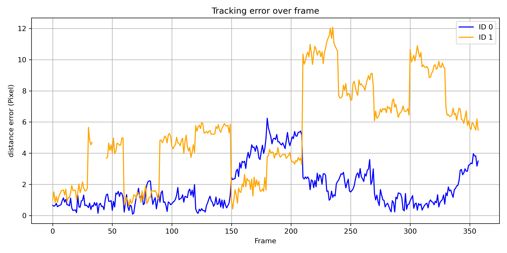

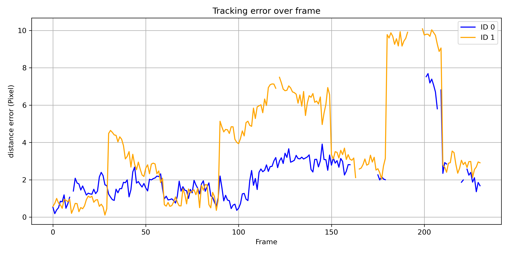

There are problems with occlusion. The maximum deviation is large and persists throughout large parts of the video. The following figure shows the progression of the deviations. When the markers are occluded, the position information is lost. The tracker then assumes incorrect position values for both markers. When the marker becomes visible again, the tracker only recognizes marker 0 and the correct trajectories are determined there again.

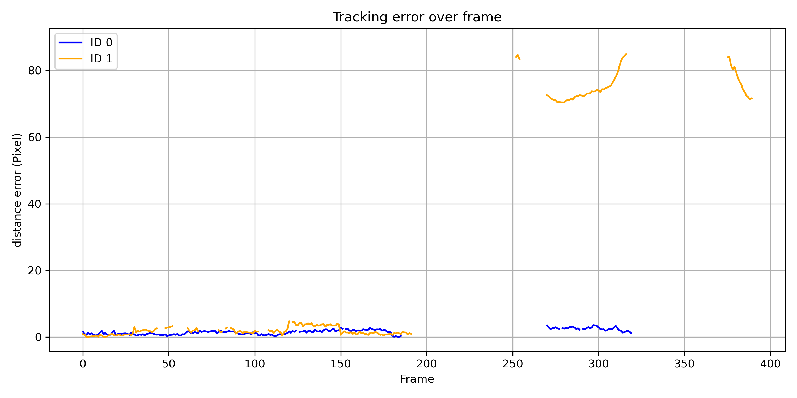

The detection of occlusion is faulty. Occlusion is detected for a short period of time, but then another visible point is tracked (see following figure).

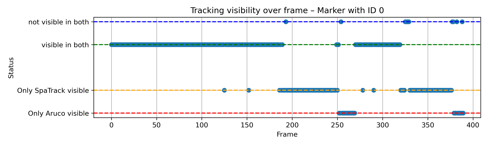

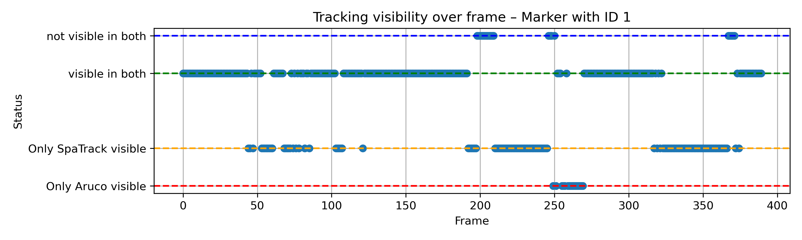

Overall, it can be said that movements and changes in shape are detected very well. There seem to be difficulties with occlusions. It should be noted that we are only using one video sequence as a reference. With this occlusion lasting approx. 100 frames, the Spatial Tracker does not show good results.  

### Comparison between ToF ground truth and tracker

The comparison between the ground truth provided by the ToF-camera and the results produced by our SpatialTracker shows that the result quality depends largely on the type of object being tracked.
While simpler objects such as the "exercise ball" and the "blackboard eraser" were tracked consistently over the duration of the video, tracking the "Theraband" proved more challenging.
Adding markings to the band improved the tracking performance to some extent, but not in a consistent manner — the results still varied considerably.
This may be due to the nature of the Theraband, which is highly unstable in its dimensions and can be stretched into a line or compressed into a ball.
This appears to be a complex issue that merits further investigation.

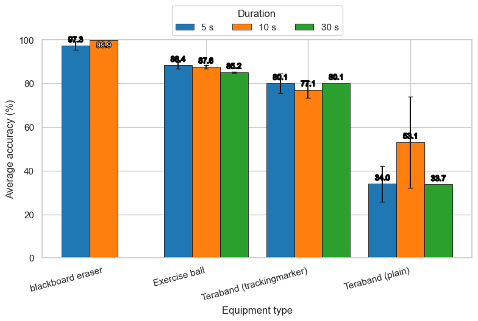

In contrast, the tracking performance over time remained fairly consistent. The tracking quality in the third dimension only decreased slightly.
This was not necessarily what we expected.

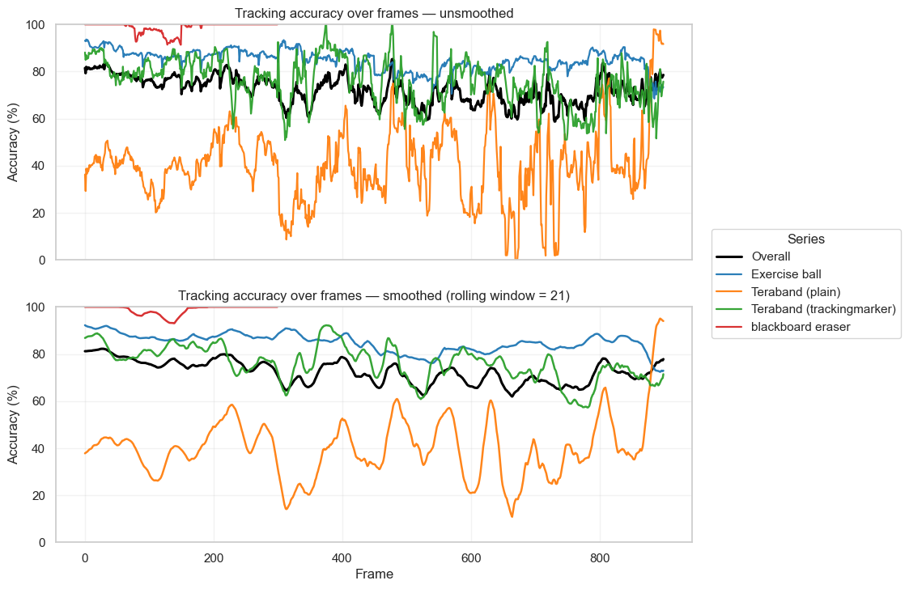

Again, the plot above shows that tracking accuracy depends primarily on the type of workout equipment rather than on the duration.

Another point to note in the process is that it only worked reliably with good initial masks. For automated testing, some automatically generated masks — especially those for the Theraband — were of insufficient quality and had to be replaced manually. This was done to focus on the quality of tracking rather than on the inline masking.

