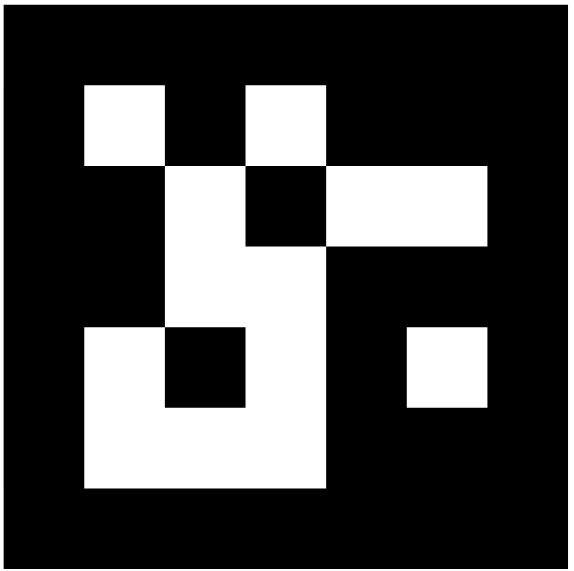
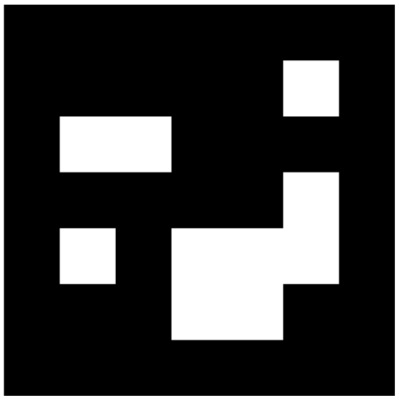
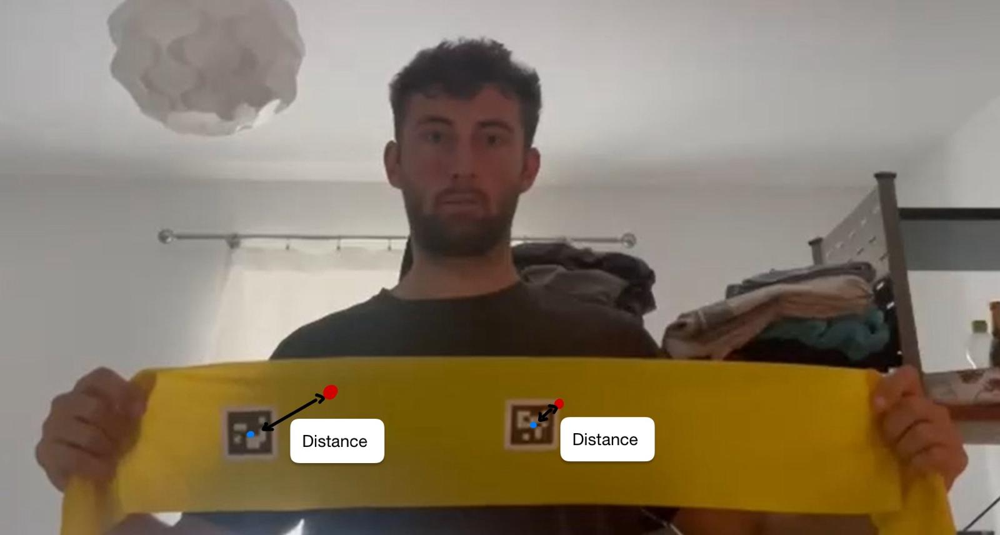

# Results and Evaluation

In this chapter we want to describe our evaluation process. It was a challenge to come up with metrics which can accurately measure the tracking performance. All the metrics used in the three papers of TAPIR, CoTracker and SpatialTracker did not fit really well for our purpose. In the end, we agreed on two metrics which we will describe in the first place. Afterwards, the results of each metric are discussed. In addition, the runtime is evaluated.

## Metrics

### Runtime evaluation

Jonas?

### 2D tracking efficiency

With this approach the tracking efficiency in the 2D space is evaluated. For this a short introduction into ArUco markers, as shown in the figure below, is needed. ArUco markers are binary square markers widely used in computer vision for camera pose estimation and object localization. Each marker consists of a unique black-and-white pattern which ensures robust detection under varying lighting conditions. By identifying the specific ID encoded in the marker’s pattern, computer vision algorithms can distinguish between different markers in a scene. In our tracking application, the detection of the position of the ArUco markers establish a ground truth trajectory which can then be used to compare against the real trajectory from the SpatialTracker.

<figure style="text-align: center;">
  
  
  <figcaption>Figure: 5x5 ArUco markers

Left: ID 0; Right: ID 1</figcaption></figure>

The figure below presents a schematic overview of the approach for one single frame. This setup is for demonstration purposes only and does not represent an actual experiment.

<figure style="text-align: center;">
  
  <figcaption>Figure: Schematic 2D evaluation with ArUco markers</figcaption>
</figure>

The experimental setup involved recording three video sequences, each the two ArUco markers shown above in a size of 4cm x 4cm attached to a resistance band which is recorded approximately from a distance of 1,5 meters. The setup includes three levels of difficulty in handling the resistance band:

1. Movement only – the band is simply moved without deformation.

2. With stretching – the band is actively stretched, introducing shape changes.

3. With occlusion – the ArUco markers are fully occluded during motion.

Each video was first processed using a Python script (`arucoDetection.py`) which detects the ArUco markers in every frame. For each detected marker, the pixel coordinates of its midpoint were calculated and stored as a NumPy array file (.npy) for subsequent analysis. In above figure these are the blue points.

In the next stage, the same video was fed into the SpatialTracker. The points selected for tracking were the midpoints of the ArUco markers in the first frame of the video. SpatialTracker then computes the corresponding 3D trajectories of the points over time which were exported in JSON format for further evaluation. In the schematic these are represented by the red circles.

In the python script `evaluateTracking.py`, both stored files are loaded. The Euclidean distance between the pixel coordinates obtained from the SpatialTracker and those from the ArUco marker detection is then computed for each frame. The tracking evaluation produces several quantitative metrics, namely the mean error, the root mean square error (RMSE), and the standard deviation. A larger distance indicates poorer tracking performance, whereas a smaller distance corresponds to better accuracy.

### Comparison between TOF ground truth and tracker

Arian, Lukas?

## Results

### Runtime evaluation

Jonas

für jedes objekt, was wir mit der TOF kamera aufgenommen haben:

einmal mit rgb daten

- 5s, 10s, 30s länge
- 720p, 360p auflösung
- 20, 50, 100 grid size

einmal mit rgbd daten

- 5s, 10s, 30s länge
- 720p, 360p auflösung
- 20, 50, 100 grid size

python file schreiben, das schöne plots macht und die ergebnisse der variation der parameter zeigt (**nicht lukas sein skript**)

Auswertung hier rein schreiben in text form

### 2D tracking efficiency

Leonie

2 aruco marker
3 videos
1: 1 in die mitte, der andere rechts (nur bewegen)
2: 1 in die mitte, der andere rechts (stretchen)
3: 1 in die mitte, der andere rechts (verschwindet)

nur wenig punkte, man kann nicht auf die gesamtheit schließen

### Comparison between TOF ground truth and tracker

Arian, Lukas?
