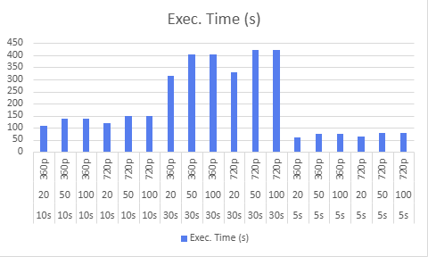
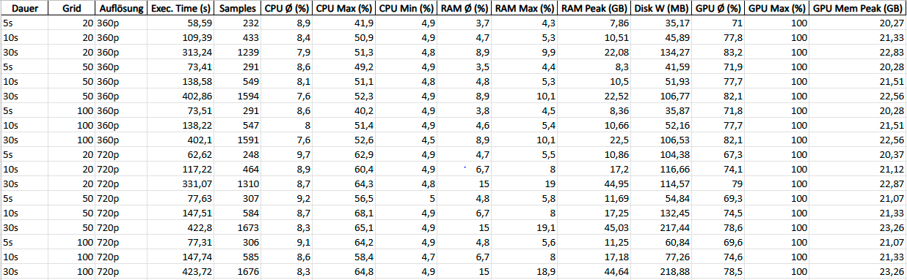

# Results and Evaluation

In this chapter we want to describe our evaluation process. It was a challenge to come up with metrics which can accurately measure the tracking performance. All the metrics used in the three papers of TAPIR, CoTracker and SpatialTracker did not fit really well for our purpose. In the end, we agreed on two metrics which we will describe in the first place. Afterwards, the results of each metric are discussed. In addition, the runtime is evaluated.

## Metrics

### Runtime evaluation

For evaluating runtime performance, a systematic approach was designed to capture the computational load of the tracking process under different conditions. Both RGB and RGB-D data were considered to analyze differences in resource usage and efficiency.

Experimental Setup
For each object recorded with the ToF camera, videos with varying length and resolution were used:

Video durations: 5 s, 10 s, 30 s

Resolutions: 720p, 360p

Grid sizes for SpatialTracker: 20, 50, 100

Measurements were performed once with pure RGB videos and once with RGB-D videos to account for the potential additional computational load from depth data.

Data Collection
The runtime was measured using the Performance_Metrics class, which continuously records:

CPU usage (%)

RAM usage (percentage and absolute GB)

Disk I/O (MB read and written)

GPU utilization (%) and memory usage (if available)

The metrics were collected throughout the entire tracking run. Optionally, py-spy can be used for periodic CPU profiling to identify performance bottlenecks in the Python code.

Analysis Approach
After completing the tracking runs, the collected metrics were used to generate visualizations illustrating:

Temporal evolution of system resources: CPU, RAM, disk, and GPU usage over time.

Comparison across grid sizes: Efficiency and resource peaks for 20, 50, and 100 tracking points.

Comparison across resolutions: Effect of 720p vs. 360p on runtime and resource usage.

Comparison between RGB and RGB-D data: Additional computational load introduced by depth information.

The evaluation results are presented as clear plots, enabling direct inspection of the relationships between resolution, grid size, data type (RGB vs. RGB-D), and resource consumption.

### 2D tracking efficiency

With this approach the tracking efficiency in the 2D space is evaluated. For this a short introduction into ArUco markers, as shown in the figure below, is needed. ArUco markers are binary square markers widely used in computer vision for camera pose estimation and object localization. Each marker consists of a unique black-and-white pattern which ensures robust detection under varying lighting conditions. By identifying the specific ID encoded in the marker’s pattern, computer vision algorithms can distinguish between different markers in a scene. In our tracking application, the detection of the position of the ArUco markers establish a ground truth trajectory which can then be used to compare against the real trajectory from the SpatialTracker.

<figure style="text-align: center;">
  
  
  <figcaption>Figure: 5x5 ArUco markers

Left: ID 0; Right: ID 1</figcaption></figure>

The figure below presents a schematic overview of the approach for one single frame. This setup is for demonstration purposes only and does not represent an actual experiment.

<figure style="text-align: center;">
  
  <figcaption>Figure: Schematic 2D evaluation with ArUco markers</figcaption>
</figure>

The experimental setup involved recording three video sequences, each the two ArUco markers shown above in a size of 4cm x 4cm attached to a resistance band which is recorded approximately from a distance of 1,5 meters. The setup includes three levels of difficulty in handling the resistance band:

1. Movement only – the band is simply moved without deformation.

2. With stretching – the band is actively stretched, introducing shape changes.

3. With occlusion – the ArUco markers are fully occluded during motion.

Each video was first processed using a Python script (`arucoDetection.py`) which detects the ArUco markers in every frame. For each detected marker, the pixel coordinates of its midpoint were calculated and stored as a NumPy array file (.npy) for subsequent analysis. In above figure these are the blue points.

In the next stage, the same video was fed into the SpatialTracker. The points selected for tracking were the midpoints of the ArUco markers in the first frame of the video. SpatialTracker then computes the corresponding 3D trajectories of the points over time which were exported in JSON format for further evaluation. In the schematic these are represented by the red circles.

In the python script `evaluateTracking.py`, both stored files are loaded. The Euclidean distance between the pixel coordinates obtained from the SpatialTracker and those from the ArUco marker detection is then computed for each frame. The tracking evaluation produces several quantitative metrics, namely the mean error, the root mean square error (RMSE), and the standard deviation. A larger distance indicates poorer tracking performance, whereas a smaller distance corresponds to better accuracy.


### Comparison between TOF ground truth and tracker

We implemented an end-to-end pipeline (`eval_pipeline.py`) to compare SpatialTracker outputs against **Time-of-Flight (ToF)** depth frames. Given a clip slug, the pipeline downloads and re-encodes the RGB video, derives a first-frame object mask (from the project’s segmentation), runs the chunked online variant of SpatialTracker, fetches the corresponding ToF `.npy` frames, performs a depth-aware analysis, and generates a ToF overlay video with track visualization.

#### Coordinate mapping (processed → ToF)

Let \$(x\_p,y\_p)\$ be tracker coordinates at the processed resolution \$(W\_{\text{proc}},H\_{\text{proc}})\$, and \$(W\_{\text{tof}},H\_{\text{tof}})\$ the ToF frame size. We map to ToF pixel indices by

$$
s_x=\frac{W_{\text{tof}}}{W_{\text{proc}}},\quad s_y=\frac{H_{\text{tof}}}{H_{\text{proc}}},\qquad
(x_{\text{tof}},y_{\text{tof}})=\big(\,\mathrm{round}(s_x\,x_p),\;\mathrm{round}(s_y\,y_p)\big).
$$

#### Mask warp (geometric prior)

The first-frame binary mask is used only as a **geometric prior**. A homography \$H\$ is estimated from points that started inside the mask and are visible at \$t=0\$ and \$t\$:

```math
\begin{bmatrix}u\\v\\1\end{bmatrix}\sim
H\begin{bmatrix}x\\y\\1\end{bmatrix},\qquad
H=\text{RANSAC}\big(\{(x_0,y_0)\leftrightarrow(x_t,y_t)\}\big).
```

The mask is warped to frame \$t\$ and slightly dilated to tolerate small warp errors. Membership in the warped mask counts as a positive vote.

#### Local ToF depth and object depth band

For a projected point \$(x\_{\text{tof}},y\_{\text{tof}})\$ we take a **robust local depth** as the median in a small window, ignoring zeros (no return).

To decide whether a tracked point is consistent with the ToF signal, we maintain an **object depth band** per frame. The band is estimated from ToF samples and smoothed over time using an exponential moving average. In the overlay path, depths are sampled inside the warped mask; in the metrics path, samples are taken at the current visible track locations (mask-agnostic). The band half-width uses the larger of a fixed minimum tolerance (≈6 cm) and a term proportional to the median absolute deviation (≈2.5×MAD). A point is accepted by depth if its local ToF median lies inside the current band.

#### Decision rule and outputs

Geometry and depth are combined: a point counts as correct if it is **inside the warped mask** or **passes the depth test**. A short majority vote over recent frames reduces flicker from transient sensor dropouts. In the overlay, accepted samples are drawn **green**, rejected **red**, and optionally **yellow** if the tracker reports invisibility while ToF has no local return.

**EVALUATIONSERGEBNISSE Lukas**


## Results

### Runtime evaluation

#### 1. Execution Time
The execution time increases with both video length and resolution.
For 360p, the runtime for 30-second videos is approximately 402–313 seconds, depending on grid size.
At 720p, the runtime for the same 30-second videos increases to 424–331 seconds.
This shows that 720p consistently takes about 5–10% longer than 360p, regardless of grid size.
The increase in execution time is due to higher computational requirements at higher resolution, even though GPU utilization is already saturated.

<figure style="text-align: center;">
  
</figure>

#### 2. GPU Utilization and Memory
GPU utilization remains very high, averaging between 70% and 83%, and regularly peaking at 100%.
This indicates that the GPU is the main performance bottleneck during all runs.
GPU memory usage also scales with video length and resolution.
For 360p runs, peak GPU memory usage reaches 22.8 GB, while at 720p it increases slightly to 23.3 GB.
This suggests that higher resolution does not drastically increase GPU memory consumption, but does prolong GPU processing.

#### 3. CPU Usage
The CPU shows only moderate activity throughout all tests.
Average CPU usage remains between 7% and 9%, with peak usage occasionally reaching 50–65%.
This demonstrates that the CPU is not a limiting factor in the pipeline.
The workload is dominated by the GPU, and CPU overhead is relatively stable across all configurations.

<figure style="text-align: center;">
  
</figure>

#### 4. System Memory (RAM)
System memory usage differs significantly between 360p and 720p.
For 360p runs, RAM usage peaks between 8 GB and 22 GB.
At 720p, RAM demand increases sharply, with peak usage reaching 45 GB during 30-second runs.
This means that 720p resolution requires roughly twice as much RAM as 360p.
Such high memory usage may exceed the capacity of typical workstations and therefore reduces scalability for longer 720p sequences.

#### 5. Disk I/O
Disk input and output activity remains relatively low compared to other resource demands.
Data written to disk increases with video length, ranging from 35 MB for 5-second runs to about 200 MB for 30-second runs.
Since both read and write operations remain small compared to modern disk bandwidth, disk I/O is not a performance bottleneck in any of the tested scenarios.

<figure style="text-align: center;">
  
</figure>

#### 6. Key Findings
Execution time at 720p is consistently longer than at 360p, by roughly 5–10%.

The GPU is always fully utilized, making it the primary performance bottleneck.

The CPU does not limit performance, since its average load is low.

System RAM demand nearly doubles at 720p, which significantly limits scalability for longer videos.

Disk I/O has no negative impact on performance.

einmal mit rgbd daten

- 5s, 10s, 30s länge
- 720p, 360p auflösung
- 20, 50, 100 grid size

python file schreiben, das schöne plots macht und die ergebnisse der variation der parameter zeigt

### 2D tracking efficiency

Leonie

2 aruco marker
3 videos
1: 1 in die mitte, der andere rechts (nur bewegen)
2: 1 in die mitte, der andere rechts (stretchen)
3: 1 in die mitte, der andere rechts (verschwindet)

nur wenig punkte, man kann nicht auf die gesamtheit schließen

### Comparison between TOF ground truth and tracker

Arian, Lukas?
